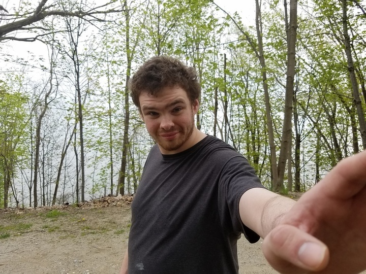

# What Haunts Parents of the Severely Autistic: What If?

**By David Royko**

My almost-23 year old severely autistic son Ben and I were walking along a favorite path on the shore of Lake Erie in Cleveland when I saw the very pretty jogger running our way. Passing us, she gave a big smile.

Smiles tossed our way are typical, but not always right away. On this day, Ben was having a great time, enjoying our sojourn. It was easy to tell because he was singing his self-composed songs.

“Ah lah lah lah Bubbe! Ah lah lah lah Big Bird! Hef! Hef!!!” and “Ah-Wheee-ah-Wheee ah-Wheee-ah-Wheeee-ah-Wheeeeeeeeeeeee....T!” were the two favorites of the day, belted out at fortissimo as he walked at a jogger’s pace.

It brought smiles of understanding from a middle-aged couple dog-walking up ahead, but only after looking back at us with furrowed brows, startled by the Ben blasts.

Ben’s “differences” are not subtle, and he’s big. One of my stock phrases, often uttered in clothes stores and fast-food joints and bookstores, and especially around startled and staring kids and their parents, is, “He’s very noisy, but very friendly.” It usually does the trick, and the smiles come.

But this smile was different ― shockingly so. It wasn’t at “us,” only directly at Ben. And it sure wasn’t the usual sympathetic smile.

It was flirtatious.

I spun around as she zipped by to see that Ben, at that moment, happened to be looking her way and, as he had been for the whole walk, beaming his beatific smile.

And, he wasn’t howling his tunes. For that brief moment in her field of vision, Ben was simply another handsome 20-something meeting her gaze with a grin, and worthy of a return glance from a chronologically contemporary lass in jogging shorts, who obviously hadn’t noticed the book he was carrying: Spot Loves Bedtime.

I felt like crying. They would not have been tears of joy.

“What if...?”s inhabit a mental space many parents of severely autistic progeny try to avoid. Really, most of the time, we’re so swamped with the realities of what is, we don’t have the time or energy to “go there.” But, at least for me, it is ultimately unavoidable.

What if Ben were “typical?” Friendships, traveling, lovers, conversations, marriage, adventures, sex, parenthood ― there are countless joys he will never know. Sometimes I find myself staring at him as we sit in the backseat, trapped in “What if...?”

What if Ben would look over at me and say, “Dad, don’t say anything to this girl that’ll embarrass me because I really like her, so actually, maybe you should just drop me off,” instead of something like, “Go to McDonald’s,” 10 times in an hour.

What if Ben were the one behind the wheel, laughing, not at some mysterious, internal script, but at his buddy riding shotgun telling a raunchy joke. What if he could play a Schubert impromptu on piano instead of just listening with the rapt attention that tells us he loves it, even if he’ll never perform it himself? What if he could have become a renowned pianist? And dammit, he really might have.

That’s one thing about a chronic, lifelong disorder like severe autism ― it never really lets go. Maybe it loosens a bit, but then it’ll remind you of unavoidable realities, and the grip tightens once again.

I feel the grip tightening and realize where my mind’s wandered because my heart is breaking. I try hard to think of other things.

And I do. After giving Ben a kiss on the head.

He gives me another beauty of a smile, and helps me to mentally move along to a wholly rhetorical, and much better, “What if...?”

“What if he weren’t so cute?”

*David Royko is a licensed clinical psychologist, director of Family Mediation Services of Chicago's Circuit Court of Cook County, and writer. His work has appeared in the Chicago Tribune, Parents Magazine, New York Times, Chicago Reader, Village Voice, Chicago Sun Times, Bluegrass Unlimited, and No Depression Magazine, among other print and web publications.He has adult twins, Jake and Ben, and lives in the Chicago area with his wife, Karen.*

*This story was first published on Huffpost in 2016*
