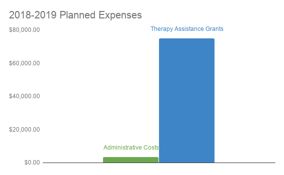

# Financials

Financial transparency is important to us. We want to assure our donors that your contributions will impact those who need it most. Because we just received our 501(c)3 nonprofit status from the IRS in April of 2018, we are just entering the fundraising process and don’t have a financial history to share yet. However, once we have funds, we pledge to fully disclose how we use all donations, so you can know your dollars really will change the lives of locals with autism. Until then, we want to share our financial goals for the coming fiscal year.

With no physical location and no paid staff (thanks to our hardworking board of directors), our overhead costs this year are minimal. We anticipate that administrative costs (including insurance & accounting fees, website costs, marketing, etc.) will come to approximately $3,500. The rest of our expenses will go toward funding Therapy Assistance Grants. Our goal is to be able to provide 10 grants of up to $7,500 each in our first year for a total of $75,000 in grants.

We will always work to ensure your donations have the greatest impact on our autism community.
