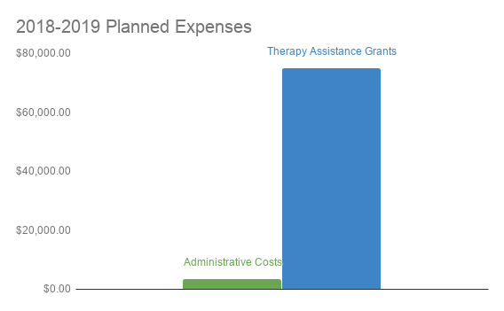

# Kimi's first Markdown

**This** is an easy way to write _important_ documentation or blogs.

Kimi will use markdown to
* write the blogs
* build the static pages
* write other stuff as needed

david will get the markdown files from kimi and
1. Push them to the website
1. Load them to github
1. Other stuff

| Table | Here|
|---|---|
|Table Stuff|also here|

